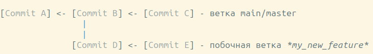
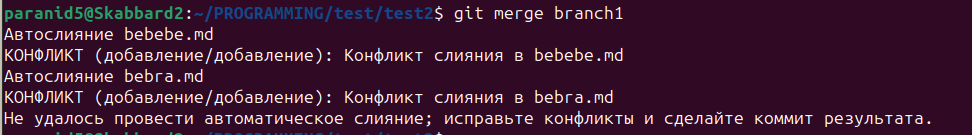
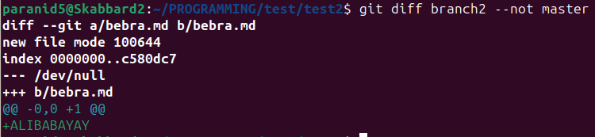
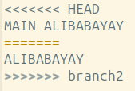
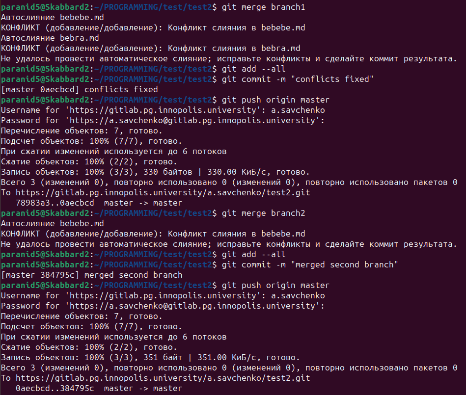
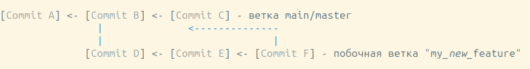

# Git для самых маленьких

**Git** - сисетма контроля версий (Version Controll System), позволяющая управлять изменениями в исходном коде на протяжении всего периода разработки. Git хранит исходный код в удаленных репозиториях, с помощью которых возможно откатить изменения до некого снимка исходного кода в прошлом.

P.S. Итоговые алгоритмы поведения в самом низу. Ниже будет теория, чтобы понять, че это такое

## Git как хостинг

Git хостинги (GitHub, GitLab, GitFlic и т.п.) предоставляют разработчику бесплатный хост исходного кода: все файлы и папки с кодом, простые ресурсы (изображения, музыка, шрифты, макеты и т.п.) и скрипты запуска. Стоит заметить, что хостинги ограничивают размер файлов, которые можно хранить - исполняемые бинарные файлы (например, my_game.exe) могут не пройти "модерацию" из-за веса.

Существует возможность запретить Git передавать файлы, в том числе бинарные или сгенерированные компилятором (например, MyClass.class для JVM), с помощью файла .gitignore. Существует [хороший генератор](https://www.toptal.com/developers/gitignore) для main-stream языков и библиотек, который задает паттерны файлов, нежелательных к отправке. В качестве примера, возьмите [следующий файл] (https://github.com/dinaraparanid/PrimaMobile/blob/master/.gitignore), запрещающий отправку как отдельных файлов с помощью регулярного выражения, так и целых папок.

## Инициализация репозитория

Удаленный репозиторий ининциализируется с помощью выбранного хостинга (GitHub, GitLab и т.п.). В рамках курса мы знакомимся с GitLab, поэтому рассмотрим процесс создания простого репозитория (если он ещё не создан):

1. Перейди на GitLab и нажми на плюс в верхнем левом углу
2. New project/repository
3. Create blank project   
4. Дай имя, укажи все необходимые параметры и тыкай *Create prject*

Ура, репозиторий готов к работе

Перейди на страницу только что созданного репозитория. Скорее всего, будет уже создан простой README.md файл, в котором будет дан гайд того, как этим пользоваться. Рассмотрим процесс локальной конфигурации проекта.

1. Перед началом, добавь всех людей, с которыми ты разрабатываешь проект. Для этого перейди в секцию Manage/Members/Invite members. Добавь всех, кого нужно, указав их роль (скорее всего, developer).

2. Далее следует разрешить необходимым (если не всем) людям коммитить в main/master ветку. Для этого перейди в Settings/Repository/Protected branches и нажми Unprotect

3. Чтобы перенести удаленный репозиторий на свою машину, перейди в папку, где хочешь создать проект.

4. В удаленном репозитории на GitLab зажми конпку *Clone* (горит синим) и скопируй ссылку под *Clone with HTTPS*. Мы будем использовать протокол HTTPS в силу его общей очевидности.

5. Открой консоль и введи следующее:

```Shell
$ git clone https://gitlab.pg.innopolis.university/a.savchenko/gitlabtest.git # здесь твоя ссылка
```

4. Репозиторий скачается и запишется в папку. Можешь приступать к работе!

## Работа с удаленным репозиторием

### Коммиты

**Коммит** - это снимок состояния исходного кода. Каждый коммит идентифицируется хеш-кодом (используется SHA хеш). Сам по себе, коммит - это бинарный файл с очень сложным алгоритмом (подробнее читай самостоятельно), но нам это маловажно. Работает система коммитов следующим образом:

[Commit A] <- [Commit B] <- [Commit C]

A, B, C - это хеш-коды этих коммитов, к которым можно обращаться для доступа к конкретному коммиту.

Чтобы добавить новый коммит, используется следующий алгоритм (просто запомни):

```Shell
$ git add <файл>
$ git pull origin main (обновить ветку в соответствиии с удаленной веткой main)
$ git commit -m "сообщение к коммиту (например, вкусно покушал)"
$ git push <название_удаленного_репозитория> (после нашего алгоритма выше должен быть origin)  <название_ветки> (на GitLab основная ветка - main, на GitHub - master) (прим. git push origin main)
```

*Note:* команду *git pull* следует избегать. Подробнее читай в секции о ветвлении. Однако при обновлении ветки через эту же самую удаленную ветку (т.е. обновить master в соответствиии с удаленной origin/master) команда git pull не должна приводить к кривым ситуациям

*ЕСЛИ СЛУЧИЛАСЬ ОШИБКА НА push*: *git reset HEAD~* (отменить вышесозданный ЛОКАЛЬНЫЙ коммит); далее повторить *git pull* и *git commit*

Команда *git add* добавляет файл в *область индексирования* (область файлов, изменения которых зафиксированы и готовы к отправке на удаленный репозиторий через коммит). Если добавлять каждый файл влом, используй *git add --all*

Команда *git commit -m "..."* создает коммит на *локальном репозитории* (папка .git). Если необходимо добавить, зафиксировать и закоммитить все возможные файлы, используй *git commit -am "..."* - комбинация add --all и commit -m.

Команда *git push* отправляет данные на удаленный репозиторий

### Ветвления

VCS Git отличается от остальныйх VCS крайне шустрой и удобной системой параллельной разработки - **ветвлений**. Существует возможность работать над одним проектом в отдельных специфических ветках, имеющих свою историю изменения.

Однако перед этим, введем ещё несколько терминов:

**HEAD** - указатель на текущий коммит, в котором мы работаем. Проще говоря - метка "Ты здесь".

**Main/Master ветка** - основная ветка, инициализированная для самого рабочего и проверенного кода. Иными словами, код в ней должен быть максимально адекватным и проверенным.

Пример ветки:



Создается ветка из коммита, на который указывает HEAD следующим образом:

```Shell
$ git checkout -b my_new_feature
```

Команда выше позволяет сразу же создать и перейти на новую ветку. Флаг '-b' позволяет создать новую ветку. Без него мы просто переходим на последний коммит в *уже созданной* ветке. Заметь, что в примере выше, в момент создания ветки указатель HEAD находился на коммите B, затем работа в ветке main продолжилась.

### Работа с ветками и слияния: pull, merge

Если ты забыл, в какой ветке сейчас, или же нужен список всех веток на локальном репозитории:

```Shell
$ git branch

  branch1
  branch2
* my_new_feature
  master
```

Работать с побочной веткой можно точно также, как и с веткой main/master:

```Shell
$ git add --all
$ git commit -m "commit in my branch"
$ git push origin my_new_feature
```

Стратегия с pull и reset точно такая же, если в вашей ветке работают несколько человек. Однако если ты один работаешь в ветке - это излишне, потому что все изменения у тебя уже есть.

#### Обновление веток

Профессиональные разработчики избегают явного использования команды *git pull* в силу ее неочевидности в стратегии слияния/перемещения коммитов. Чтобы избежать трагедии (или кучи настроек), будем использовать следующий метод обновления веток:

```Shell
$ git fetch <remote> (origin) <ветка>
$ git merge <ветка>
```

Обе команды, как и pull, обновят код в соответствии с удаленной веткой, но сделают это явно. Это рекомендуемая стратегия к обновлению веток. Советую не использовать git pull при получении информации с разных веток. Более того, алгоритм выше применим и к обновлениям в одной ветке, поэтому это универсальный метод. Короче, используй его всегда :}

Эта штука сразу же скачает все обновления с удаленного репозитория из удаленной ветки и обновит твой код в соответствии с последним коммитом в удаленной ветке.

#### Слияние веток

Сначала рассмотрим сценарий, когда *изменения в ветке main (или от той, которая зависит наша ветка) не происходили*, и мы готовы слить текущие нароботки с основной веткой. Перед этим все изменения **необходимо сохранить на нашей удаленной ветке по алгоритму выше**. Алгоритм слияния с основной веткой *ЕСЛИ ИЗМЕНЕНИЙ НЕ БЫЛО* следующий:

```Shell
$ git checkout main
$ git merge my_new_feature
$ git push origin main
```

Представим, что в примере выше ветка main продолжила эволюцию, однако эти изменения не были зафиксированы в нашей побочной ветке. Если мы постараемся слить нашу ветку, произойдет следующее:



Чтобы показать, в чем именно различаются ветки, используется команда git diff:

```Shell
$ git diff <ветка1> --not <ветка2>
```

Команда покажет изменения, которые есть в ветке1, но не в ветке2.



Пройдемся по всем конфликтным местам, которые показала команда git dif или git merge. Все конфликтные файлы будут изменены в соответствии со следующей схемой (картинка ниже). Устрани все конфликты и затем продолжи базовый алгоритм. Пример того, как именно необходимо слить все ветки ниже





Пример того, как это выглядит в итоге:



Коммит F слил изменения ветки main и my_new_feature

#### Удаление веток

После того, как вся суть ветки иссякла, код был проверен и слит в основную ветку, побочную ветку желательно удалить дабы не усложнять историю проекта. Делается это с помощью следующей команды:

```Shell
$ git branch -d <ветка>
```

# Алгоритмы для чайников

1. Коммит в текущую ветку

```Shell
$ git add --all # добавить все измененные файлы в область индексирования
$ git fetch origin <master> # скачать все изменения, если они были
$ git merge <master>
$ git commit -m "скушал пироженку"
$ # Дополнительно, если облажался:
$ git reset HEAD~ # затем повторяешь всё, начиная с fetch, параллельно устраняя конфликты, если будут
$ git push origin <master>
```

2. Откатить изменения

```Shell
$ git reset HEAD~ # откатить текущий коммит AKA переназначить HEAD на предыдущий коммит
$ git reset HEAD~3 # откатиться на 3 коммита назад
$ git reset HEAD^ # тоже самое, что и HEAD~
$ git reset HEAD^2 # откатиться ко второму предку (только, если коммит был слит (merged))
```

3. Создать ветку и что-то добавить

```Shell
$ git checkout -b branch1
$ git add --all
$ git commit -m "лег спатеньки"
$ git push origin branch1
```

4. Обновить ветку в соответствии с удаленной веткой (например, обновить в соответствии с master)

```Shell
$ git fetch origin master
$ git merge master
```

5. Слить побочную ветку (перед этим все изменения закоммитить) с веткой main/master

```Shell
$ git fetch origin master
$ git merge master
$ # На этом этапе может быть конфликт, который нужно исправить и закомитить (смотри примеры выше)
$ git checkout master
$ git merge branch1
$ # На этом этапе также может возникнуть конфликт, стратегия идентична
$ git push origin master
```
